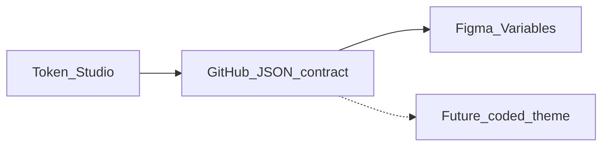

# Momentum Token Expansion — Product Requirements Document

| Field | Value |
|-------|--------|
| Initiative | Momentum Web Library — component-level token expansion for AI-ready design–code contracts |
| Epic owner | Claire Kim (Design) |
| Status | Draft for design systems + stakeholder review |
| Timeline | Sprint 16 end **Aug 18, 2026** (proposal + token publish + rollout plan) · Sprint 18 end **Sep 1, 2026** (full MWL implementation) |
| Related | [03-token-ingestion-spec.md](./03-token-ingestion-spec.md), [06-implementation-plan.md](./06-implementation-plan.md), [00-Product Requirements Document.md](./00-Product%20Requirements%20Document.md) (color audit plugin) |

---

## Overview

**Initiative:** Expand the Momentum token system and apply it across the **Momentum Web Figma Library (MWL)** so component properties are explicitly tokenized—not hard-coded—creating a deterministic contract between design specs and future code.

**Audience:** Collaboration designers using MWL; Design Systems (token authors); future MWL/Magnetic engineering (coded parity, deferred).

**Purpose:** Identify component properties that should be tokens, create and publish those tokens (Token Studio → GitHub → Figma Variables), replace ad hoc values across all MWL components, and document the contract so engineering can adopt the same definitions when capacity returns.

**One-line value:** *"Every meaningful component decision is a named token in JSON and Figma—so designers, AI tools, and future code read the same contract."*

---

## Problem Statement

Momentum Web Library exists so Collaboration products ship consistent, accessible UI from a shared foundation. Today, many component properties still rely on **raw values** (hex, px, ad hoc spacing) or **implicit conventions** that are not machine-readable.

AI-assisted design-to-code workflows **amplify** this gap. Each Figma→code cycle is another chance for non-deterministic drift: agents invent options, hard-code colors, and restyle components when properties are not explicitly tokenized ([Vallaure](https://uxdesign.cc/design-system-contracts-the-component-lives-in-neither-figma-nor-code-3032d94ca067); Southleft A/B cited **69/100** adherence without strict rules vs **100/100** with a contract).

Manual handoff has the same failure mode, slower. Variant-level overrides—hover backgrounds, one-off padding—are especially risky ([Curtis](https://medium.com/@nathanacurtis/components-as-data-2be178777f21): a `#045bbc` in a hover variant instead of a token path).

**Core gap:** MWL lacks complete **component-level token coverage** and a **governed contract** (JSON as authority, Figma as copy) that AI and engineering can consume without interpretation.

---

## Strategic framing

### Token contract layer (this initiative)

`@momentum-design/tokens` JSON (via Token Studio → GitHub) is the **authoritative contract**. Figma Variables are a **faithful copy**. Future coded themes consume the same package.

**Governance rule:** Token changes flow **JSON → Figma**. Figma-only edits during rollout must be back-synced to Token Studio/GitHub before publish. Neither Figma nor code updates the other without a contract change first.

### Scope boundary

| In scope (Sprint 16–18) | Out of scope (this initiative) |
|-------------------------|--------------------------------|
| Token expansion proposal (current + new tokens) | Coded-library implementation |
| Create tokens in Token Studio, GitHub, Figma | Per-component contract files (anatomy, props, variants) |
| Apply tokens across all MWL components | Automated three-way checker (contract ↔ Figma ↔ code) |
| Component coverage matrix + engineering handoff | Full agentic design-system pipeline |
| Token-level parity verification | Non-color audit plugin (manual checklist for now) |

---

## Goals & Success Metrics

### Goals

1. **Complete proposal:** Document all current and **new** tokens with rationale, naming, and component mapping.
2. **Published contract:** Approved tokens live in Token Studio, GitHub (`@momentum-design/tokens`), and Momentum Figma Variables (1:1 naming).
3. **MWL coverage:** All in-scope MWL components use expanded tokens; raw values on semantic properties eliminated or documented as exceptions.
4. **AI-ready structure:** Token paths are machine-readable; no stray hex/px on semantic surfaces where tokens exist.
5. **Engineering handoff:** Coverage matrix + JSON contract spec + parity playbook so coded parity can start without re-discovery.

### Success metrics

| Metric | Definition | Target (Sprint 18) |
|--------|------------|---------------------|
| Token proposal completeness | % of identified gaps addressed in approved proposal | 100% of P0–P2 gaps |
| JSON ↔ Figma parity | Spot-check + diff: JSON resolved values match Figma Variables | ≥ 10 tokens verified; zero P0 mismatches |
| MWL component coverage | Components fully tokenized per coverage matrix | 100% of in-scope MWL components |
| Raw color on semantic surfaces | Audit plugin on benchmark frames per component family | Zero raw hex where theme token exists |
| Documented exceptions | Non-token values listed with rationale in matrix | 100% of remaining raw values |
| Version alignment | Published Figma library pinned to npm token package version | Single version pair documented in release notes |

*Baselines for audit-plugin metrics can reuse [02-pilot-metrics-baseline.md](./02-pilot-metrics-baseline.md) patterns where applicable.*

---

## User Stories

1. **As a Collaboration designer**, I want component properties bound to **approved Momentum tokens**, so my files stay consistent and theming works without one-off overrides.

2. **As a design system owner**, I want tokens defined **once in JSON** and mirrored in Figma, so the library does not drift from the published contract.

3. **As a design system owner**, I want a **Token Expansion Proposal** listing every current and new token with rationale, so stakeholders can review before implementation.

4. **As a designer building AI-assisted flows**, I want **named token paths** (not raw values) on MWL components, so agents apply the system instead of inventing colors and spacing.

5. **As a future engineer**, I want a **coverage matrix and JSON spec**, so I can implement coded parity without re-auditing Figma by hand.

6. **As a design system owner**, I want **variant-level token binding** verified, so hover/active/disabled states do not hide raw values.

---

## Functional Requirements

### FR-1 — Discovery & gap analysis

- **FR-1.1** Inventory all MWL components and variants (grouped by family: Button, Input, Modal, Navigation, AI surfaces, etc.).
- **FR-1.2** For each component, catalog bindable properties: color, typography, spacing, radius, border, size (fixed W/H), elevation, and effects — mapped to **core token paths** (no `component.*` alias layer for dimensions).
- **FR-1.3** Diff Figma Variables vs `@momentum-design/tokens` JSON (`tokens/`, `$metadata.json` token set order).
- **FR-1.4** Flag: raw values; core-token usage where theme semantic is required (`color/core/` vs `color/theme/`); missing token categories.
- **FR-1.5** Prioritize gaps P0–P3 by AI handoff impact (see Edge cases / priority table).

**Deliverable:** Gap analysis spreadsheet feeding the proposal.

### FR-2 — Token Expansion Proposal

- **FR-2.1** Single authoritative **Token Expansion Proposal** document including:
  - Executive summary and contract principles (JSON authority, Figma copy)
  - Naming conventions aligned with existing Momentum patterns
  - Full **current** token catalog (from JSON)
  - **Proposed additions** with type, value/alias, rationale, theme modes, AI handoff note
  - Component coverage matrix (component × property × current × proposed × raw count)
  - Documented non-token exceptions
  - Migration notes (additive vs breaking)
- **FR-2.2** DS stakeholder sign-off before token creation.

**Due:** Sprint 16 end (**Aug 18, 2026**).

### FR-3 — Token creation & publish

- **FR-3.1** Create approved tokens in **Token Studio** and open PR to GitHub token repo (`momentum-design/momentum-design` or org equivalent).
- **FR-3.2** Maintain alias chains for **color only**: theme → core; **no raw hex at theme layer**. Dimension tokens (`spacing.*`, `radius.*`, `border.width.*`, `size.*`) bind core directly — no `component.*` alias layer.
- **FR-3.3** Update `$metadata.json` / `$themes.json` when new sets or theme bindings are added.
- **FR-3.4** Bump `@momentum-design/tokens` package version; include changelog.
- **FR-3.5** Mirror JSON in **Figma Variables** (names 1:1 with JSON paths) **after** JSON PR merges.
- **FR-3.6** Support theme modes: Light, Dark, High Contrast (and existing additional themes where applicable).
- **FR-3.7** Handle **gradient tokens** (e.g. `color/theme/ai/normal`) explicitly—document Figma Variables approach if platform limits apply.

**Due:** Sprint 16 end (**Aug 18, 2026**).

### FR-4 — Parity verification (token level)

- **FR-4.1** Diff pulled JSON vs Figma variable export.
- **FR-4.2** Spot-check ≥ 10 tokens: JSON resolved value = Figma resolution on test frame.
- **FR-4.3** Run Momentum Color Token Audit plugin on benchmark frame(s).
- **FR-4.4** Log mismatches in verification doc for future automated checker.

**Deliverable:** Parity verification log.

### FR-5 — MWL rollout plan

- **FR-5.1** Document component batch order, owners, estimates, and risk register.
- **FR-5.2** Per-component checklist: replace raw values; theme not core on canvas; all variants bound; Figma discoveries back-synced to JSON; component descriptions list token paths.
- **FR-5.3** QA criteria: zero raw hex on semantic color surfaces; matrix documents every binding; light/dark/HC parity; no visual regression.

**Due:** Sprint 16 end (**Aug 18, 2026**).

### FR-6 — MWL implementation

- **FR-6.1** Apply expanded tokens across **all** in-scope MWL components per rollout plan.
- **FR-6.2** Track progress in coverage matrix (% components complete, % properties tokenized).
- **FR-6.3** Prioritize AI-related components and high-traffic primitives if schedule slips.
- **FR-6.4** Design review sign-off per batch.

**Due:** Sprint 18 end (**Sep 1, 2026**).

### FR-7 — Documentation & handoff

- **FR-7.1** Final Token Expansion Proposal.
- **FR-7.2** 100% component coverage matrix for in-scope library.
- **FR-7.3** JSON contract spec: paths, types, theme resolution, governance (JSON → Figma → code).
- **FR-7.4** Parity verification playbook for future engineering (owners, CI checklist, checker roadmap).
- **FR-7.5** Designer release notes: new tokens, usage, governance ("edit JSON, not Figma ad hoc").

**Due:** Sprint 18 end (**Sep 1, 2026**).

---

## Non-Functional Requirements

| ID | Requirement |
|----|-------------|
| NFR-1 | **Determinism:** Token contract uses JSON (W3C Design Tokens Format)—not Markdown—for same-input-same-output matching by AI and CI. |
| NFR-2 | **Versioning:** Every Figma library publish pins to a specific `@momentum-design/tokens` npm version. |
| NFR-3 | **Naming stability:** New tokens follow established Momentum paths (`color/theme/…`, `font/…`, etc.); breaking renames require migration notes. |
| NFR-4 | **Accessibility:** HC theme tokens updated wherever semantic colors change. |
| NFR-5 | **Traceability:** Git history on token repo is the changelog of record. |

---

## Naming conventions (proposal baseline)

Extend existing Momentum patterns—do not replace with external `foundations/*` schemas wholesale.

| Category | Pattern (illustrative) | Example |
|----------|------------------------|---------|
| Theme color | `color/theme/{domain}/{role}/{state}` | `color/theme/ai/normal` |
| Core color | `color/core/…` (not for canvas use) | `color/core/blue/60` |
| AI primitives | `color/ai/…` in core value set | `color/ai/steelblue` |
| Typography | `font/…` (existing) | `font/apps/body/midsize/regular` |
| Elevation | `elevation/{n}` (existing) | `elevation/2` |
| Spacing (proposed) | `spacing.{px}` | `spacing.8` |
| Radius (proposed) | `radius.{px}` | `radius.8` |
| Size (proposed) | `size.{px}` | `size.32` |

---

## Priority matrix (gap triage)

| Priority | Property types | Action |
|----------|----------------|--------|
| **P0** | Unbound colors; gradients incl. AI surfaces | Must tokenize in proposal |
| **P1** | Spacing, radius, border on Button, Input, Modal, List, Nav | Must tokenize in proposal |
| **P2** | Fixed sizing (`size.*`), focus ring, disabled opacity | Propose in Sprint 16; implement when size spec ships |
| **P3** | Low-frequency decorative overrides | Document as exception or defer with rationale |

---

## Timeline & milestones

| Milestone | Due | Outputs |
|-----------|-----|---------|
| Gap analysis complete | ~Aug 14, 2026 | Component inventory + gap spreadsheet |
| **Sprint 16 end** | **Aug 18, 2026** | Token Expansion Proposal · tokens in Token Studio + GitHub + Figma · MWL rollout plan · parity verification log |
| Sprint 17 | Aug 19 – Aug 31, 2026 | Rollout execution (batches); coverage matrix progress |
| **Sprint 18 end** | **Sep 1, 2026** | Full MWL token application · handoff package · published library + release notes |

---

## Dependencies

- Edit + publish access to **Momentum Web Figma Library**
- **Token Studio** access and **GitHub** token repository write access
- DS sign-off on naming and **JSON-first governance**
- Optional: Momentum Color Token Audit plugin for color validation during rollout

---

## Edge cases & acceptance criteria

| Case | Expected behavior |
|------|-------------------|
| **Gradient tokens** (e.g. AI brand gradient) | Explicit contract entry; Figma binding documented; not flattened to single hex without label |
| **HC themes** | Semantic token resolves to HC-safe values; verified in matrix |
| **Core token on canvas** | Replaced with `color/theme/…` equivalent per policy |
| **Variant hover/active** | Every variant state bound or listed as documented exception |
| **Figma discovery during rollout** | Back-sync to JSON before component marked complete |
| **Deprecated components** | Matrix row: migrate, exclude, or retire with owner decision |
| **Gradient / layout modes** | `HUG`/`FIXED` sizing documented; full layout-as-data deferred |

---

## Risks & mitigations

| Risk | Impact | Mitigation |
|------|--------|------------|
| Proposal scope creep | Miss Aug 18 deadline | P0/P1 only for Sprint 16 approval; P2 in parallel if capacity |
| Figma ↔ JSON drift | AI and designers read different values | JSON-first governance; parity log; version pinning |
| Gradient variable limits in Figma | AI token incomplete | Document workaround in proposal; track as known gap |
| Sprint 18 capacity | Incomplete MWL coverage | Rollout plan batches high-traffic + AI components first |
| Engineering expectations | Scope confusion | PRD + handoff doc state coded work is **deferred** |
| False confidence from partial tokenization | Remaining raw values in variants | Variant-focused checklist; audit plugin on benchmarks |

---

## Open questions & proposed resolutions

| Question | Proposed resolution |
|----------|---------------------|
| **Can tokens translate to JSON as the design–code contract?** | **Yes.** `@momentum-design/tokens` JSON is the contract; Figma Variables and future code are copies. |
| **Who owns coded-library adoption when engineering returns?** | **Design Systems** owns token contract + Figma parity + coverage matrix. **MWL/Magnetic engineering** owns coded implementation + automated parity CI. Joint sign-off on matrix completion. |
| **Markdown vs JSON for AI?** | **JSON** for tokens and future component contracts—deterministic matching ([Vallaure](https://uxdesign.cc/design-system-contracts-the-component-lives-in-neither-figma-nor-code-3032d94ca067)). |

---

## Future opportunities (post-initiative)

1. **Component-as-data contracts** — per-component JSON/YAML (anatomy, props, styles, variants) per [Curtis](https://medium.com/@nathanacurtis/components-as-data-2be178777f21).
2. **Three-way checker** — contract ↔ Figma ↔ code ([Southleft ds-contracts POC](https://github.com/southleft/ds-contracts-poc)).
3. **Extended audit plugin** — spacing, radius, non-color lint.
4. **Generated Figma variants** from structured component data.
5. **AI adherence testing** — measure agent compliance against token + contract rulebook.

---

## Related assets

| Asset | Role |
|-------|------|
| `@momentum-design/tokens` (npm) | Authoritative token contract; source for proposal catalog |
| Token Studio + GitHub token repo | Token authoring and version control |
| Momentum Web Figma Library | Target for token application |
| Momentum Color Token Audit plugin | Color validation during rollout (optional) |

---

## Reference reading

- [Components as Data — Nathan Curtis](https://medium.com/@nathanacurtis/components-as-data-2be178777f21)
- [Design system contracts — Christine Vallaure](https://uxdesign.cc/design-system-contracts-the-component-lives-in-neither-figma-nor-code-3032d94ca067)
- [Southleft ds-contracts POC](https://github.com/southleft/ds-contracts-poc)

---

*Next step: Complete gap analysis and draft Token Expansion Proposal for DS review by Sprint 16 end (Aug 18, 2026).*
