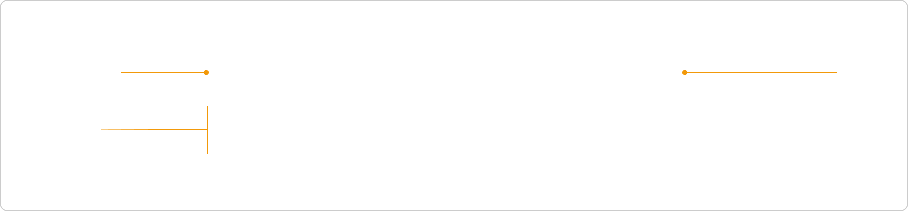
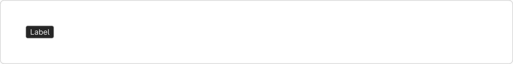
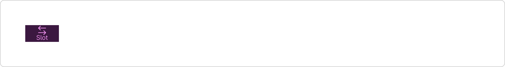
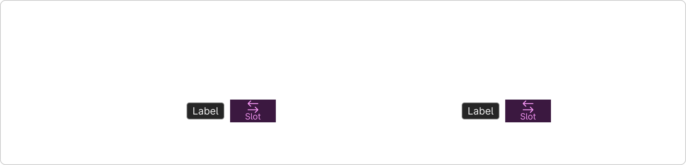
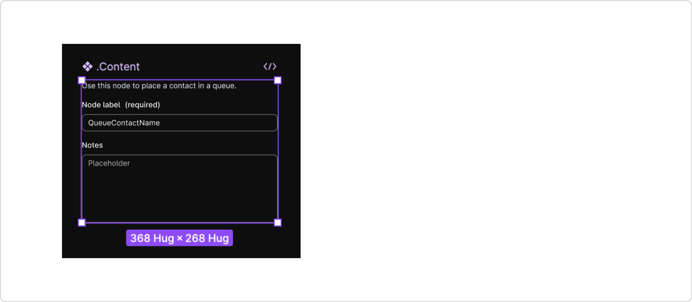

# Accordion (`mdc-accordion`)

## Development

### Summary

An accordion contains a header and body section with a focusable heading that can be expanded or collapsed.

The header section contains:
- Prefix Icon
- Header Text
- Leading Slot - Contains the leading controls of the accordion on the header section. This will be placed on the leading side, after the header text.
- Trailing Slot - Contains the trailing controls of the accordion on the header section. This will be placed on the trailing side, before the expand/collapse button.

The body section contains:
- Default slot - User can place any content inside the body section.

The accordion can be expanded or collapsed. The visibility of the body section can be controlled by `expanded` attribute. 

There are two types of variants based on that the border styling of the accordion gets reflected. 

There are two sizes of accordion, one is small and the other is large.
Small size has a padding of 1rem (16px) and large size has a padding of 1.5rem (24px) for the body section of accordion.

By default, the header text in the accordion heading is of H3 with an aria-level of '3'.
If this accordion is placed on any other level in the entire webpage, then do adjust the aria-level number based on that.

An accordion can be disabled, and when it's disabled, the header section will not be clickable.

If you don't need any controls on your accordion heading, then it's advised to use `accordionbutton` component.

If an accordion is expanded by default, then the screen reader might loose focus when toggling the visibilty of the accordion.

### Source

- Component folder: [`packages/components/src/components/accordion/`](../../components/src/components/accordion/)
- Built metadata references: `components/accordion/accordion.component.js` (from Custom Elements Manifest)

### Install and global setup

Install the library:

```bash
npm install @momentum-design/components
```

Load fonts and token CSS, set typography class, and use **ThemeProvider** / **IconProvider** where needed. Follow the full checklist in [Consumption.mdx](../../components/src/docs/Consumption.mdx) (imports, HTML example, webpack/TS notes).

### Import this component

**Web component** (registers the custom element):

```javascript
import '@momentum-design/components/components/accordion';
```

```html
<mdc-accordion></mdc-accordion>
```

**React** wrapper (from `@lit/react` codegen):

```javascript
import { Accordion } from '@momentum-design/components/react';
```

```jsx
<Accordion />
```

### Styling and common attributes

- Host `class` / `style`, CSS custom properties, `::part(...)`, and slotted content patterns: [Styling.mdx](../../components/src/docs/Styling.mdx)
- Shared attribute `auto-focus-on-mount`: [Attributes.mdx](../../components/src/docs/Attributes.mdx)

### API details

Full properties, attributes, slots, CSS parts, and events are listed in the Custom Elements Manifest. Use **Storybook** on [momentum.design](https://momentum.design/storybook-static/index.html) (same content as [momentum.design/en/components](https://momentum.design/en/components)) for interactive docs.


## Accessibility

Project Storybook enables the **Accessibility** addon with axe rules for **WCAG 2.x / 2.2 AA** and **best-practice** (see [`preview.jsx`](../../components/config/storybook/preview.jsx), `parameters.a11y`). Run checks from the [Docs](https://momentum.design/storybook-static/index.html?path=/docs/components-accordion-accordion--docs) or Canvas view.

- **Focus:** shared attribute `auto-focus-on-mount` is documented in [Attributes.mdx](../../components/src/docs/Attributes.mdx) (use instead of native `autofocus`; same caveats as MDN describes for autofocus).

Manifest / API fields that often relate to accessibility:

- `data-aria-level` — The aria level of the accordion component.

## Design

### Overview

An accordion is a vertically stacked list of headers that reveal or hide associated sections of content.


*An example of a default accordion*

### Usage

#### When to use

- Organize grouped content in a space-efficient format.
- Users may not need to read all information at once.
- Sections are independent and don’t need to be read in sequence.
- Reduce page length and scrolling when content is not crucial to read in full

#### When not to use:

- All content needs to be visible at once.
- Frequent toggling might disrupt the user experience.
- Critical information may be hidden by default.

### Anatomy



- **Header:** Displays the section title and acts as the toggle to expand or collapse the content.
- **Icon:** Visually communicates the current state — expanded or collapsed.
- **Panel:** Conetnet area that holds the detailed content that appears when the accordion is expanded, directly tied to its header.

### Types and variants

#### Single Accordion

A standalone accordion used to toggle visibility for one content section. On information-heavy pages, a standalone accordion can help conceal secondary details. There are two types for single accordion:

- **Default:** Use when visual separation from surrounding content is important — e.g., in dense pages or mixed layouts.
- **Borderless:** Use in minimalist layouts where the accordion blends with its surroundings — e.g., within forms, settings, or inline sections.


*Example of single accordion*

#### Group Accordion

A set of multiple accordions stacked vertically, allowing users to expand/collapse each section individually or in sequence. This is the most common type of accordion—multiple sections that users can expand individually to reveal content.

##### Stack

Use when clear visual separation between items is important. This approach is good when there are multiple steps and each steps has distinct content - such as onboarding, checkout.

- Helps divide content into well-defined, scannable sections.
- Ideal for interfaces where users need to compare or browse across multiple items quickly.
- Works well in content-heavy layouts such as settings, or dashboards where visual structure enhances clarity.


##### Borderless

Use in minimalist layouts or when accordions are deeply embedded within structured content.

- Ideal for dense interfaces like forms, settings panels, or FAQs where borders may feel visually heavy.
- Suitable for embedded contexts like dialogs or drawers.
- Best when visual hierarchy is already maintained by layout, spacing, or typography.
- Offers a lightweight, streamlined look with minimal visual noise.


##### Contained

Use when accordion items are grouped inside a shared visual container.

This style works well when accordion sections are conceptually tied together—such as grouped FAQs or compact content modules. It also helps conserve vertical space.


### Content Type

#### Header item

##### Title

Title provides a quick summary of the content inside each accordion panel. To maintain visual clarity and structural balance, keep accordion titles concise. Excessively long titles may overlap with other header items (e.g., buttons, icons, chips), disrupting the layout and reducing scannability.


##### Icon button

Use icon buttons to replace or supplement decorative or interactive icons (e.g., drag handle, settings).


##### Chip

Use chip to display non-interactive or interactive label such as status, count, or type.



##### Placeholder slot

If specific objects or actions are required in the header, you can use the placeholder slot to swap in your own custom content.



##### Chevron icon

Indicates the current state of the accordion and provides a clear visual cue for interaction. The icon must always be present in the header by default and cannot be removed or hidden, ensuring consistent user experience.


Figma’s caption under this figure lists:

- ⌄ (Downward): Indicates the accordion is expanded
- ⌃ (Upward): Indicates the accordion is collapsed

That legend **conflicts** with **Behavior and States** below (chevron **down** = collapsed, **up** = expanded). Prefer **Behavior and States** for implementation unless design specifies otherwise.

#### Panel item

Insert body copy or swap with your local components.

##### Body copy

Text content can be structured using multiple paragraphs and subheadings, where appropriate, to support clarity and scannability.


##### Placeholder slot

Use the Placeholder slot to insert your own custom content. See **Best practice** for guidance on how to do.


### Sizes

Accordions are available in two sizes: Small (16px padding) and Large (24px padding). Each size has a defined collapsed height, but when expanded, the height adjusts dynamically based on the content. There is no fixed minimum or maximum height—content should always be fully visible without internal scrolling. To maintain a consistent user experience, vertical scrolling should occur at the page or container level, not within individual accordion panels.

The width of an accordion is defined by the grid layout and the context in which it’s used (e.g., forms, feature panels). It should follow the responsive rules of its parent container and must not allow horizontal scrolling.


*Examples of collapsed accordion with default height of 56px.*

### Behavior and States

Accordion has two behavior: collapsed and expanded. The chevron icon at the end of the accordion indicates which state the accordion is in. The chevron points down to indicate collapsed and up to indicate expanded.

Accordions begin by default in the collapsed state with all content panels closed. Starting in a collapsed state gives the user a high level overview of the available information.

For interaction states, see **Attribute**.


*An example of collapsed and expanded behavior*

### Interaction type

Accordions support two interaction types: Single interactive and Multi-interactive.

In the Single interactive type, only the accordion header itself is clickable. Tapping or clicking anywhere on the header will expand or collapse the content panel. This type is ideal when the header does not contain other interactive elements.

The Multi-interactive type supports multiple interactive elements within the header, such as buttons, icons, or interactive chips. In this case, only the dedicated expand/collapse icon controls the accordion panel. Other interactive elements perform their own distinct actions.



*An example of Single interactive and Multi interactive.*

### Best Practice

#### Use Placeholder

Insert your custom content into the Placeholder slot. First, create your custom content as a local component in your working file. In the layer panel, select the Placeholder instance within the Accordion. Swap it with your custom component instance.



*Examples of accordion with custom content.*

### Coming Soon

Below is a list of updated content coming soon

- Do and Don’ts
- Related components
- Nested Accordion

