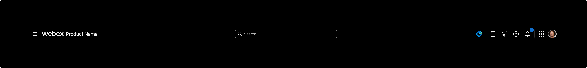
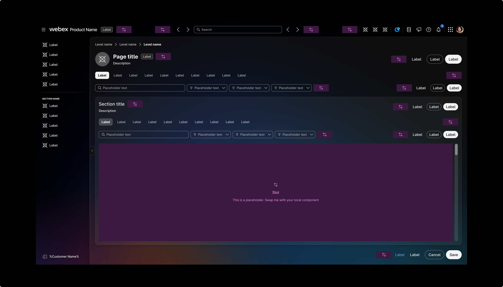
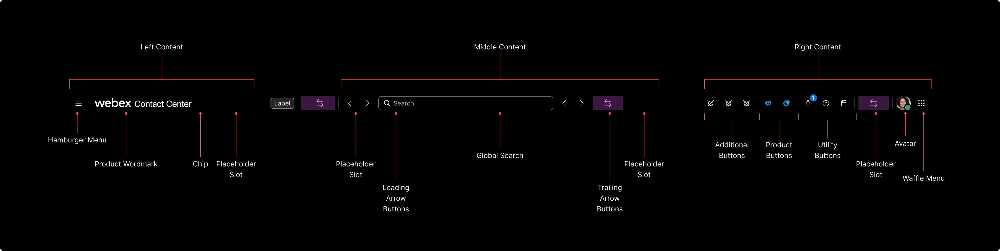

# Appheader (`mdc-appheader`)

## Development

### Summary

The `mdc-appheader` component provides a structured and accessible app header layout.
It consists of three primary sections: leading, center, and trailing.

- The **leading section** typically holds a **brand logo**, **brand name** or **menu icon**.
- The **center section** can contain a **search bar**, **icons** or action controls.
- The **trailing section** generally includes a **profile avatar**, **additional icons** or **action controls**.

### Source

- Component folder: [`packages/components/src/components/appheader/`](../../components/src/components/appheader/)
- Built metadata references: `components/appheader/appheader.component.js` (from Custom Elements Manifest)

### Install and global setup

Install the library:

```bash
npm install @momentum-design/components
```

Load fonts and token CSS, set typography class, and use **ThemeProvider** / **IconProvider** where needed. Follow the full checklist in [Consumption.mdx](../../components/src/docs/Consumption.mdx) (imports, HTML example, webpack/TS notes).

### Import this component

**Web component** (registers the custom element):

```javascript
import '@momentum-design/components/components/appheader';
```

```html
<mdc-appheader></mdc-appheader>
```

**React** wrapper (from `@lit/react` codegen):

```javascript
import { Appheader } from '@momentum-design/components/react';
```

```jsx
<Appheader />
```

### Styling and common attributes

- Host `class` / `style`, CSS custom properties, `::part(...)`, and slotted content patterns: [Styling.mdx](../../components/src/docs/Styling.mdx)
- Shared attribute `auto-focus-on-mount`: [Attributes.mdx](../../components/src/docs/Attributes.mdx)

### API details

Full properties, attributes, slots, CSS parts, and events are listed in the Custom Elements Manifest. Use **Storybook** on [momentum.design](https://momentum.design/storybook-static/index.html) (same content as [momentum.design/en/components](https://momentum.design/en/components)) for interactive docs.


## Accessibility

Project Storybook enables the **Accessibility** addon with axe rules for **WCAG 2.x / 2.2 AA** and **best-practice** (see [`preview.jsx`](../../components/config/storybook/preview.jsx), `parameters.a11y`). Run checks from the [Docs](https://momentum.design/storybook-static/index.html?path=/docs/components-appheader--docs) or Canvas view.

- **Focus:** shared attribute `auto-focus-on-mount` is documented in [Attributes.mdx](../../components/src/docs/Attributes.mdx) (use instead of native `autofocus`; same caveats as MDN describes for autofocus).

Use the Storybook **Docs** and **Accessibility** addon on the Example story for roles, keyboard support, labeling, and color-contrast results.

## Design

### Overview

The App Header is a piece of the shell for many Webex interfaces and often contain other Momentum components inside of their containers. Otherwise the App Header is unique to each product. The App Header is usually static within a product, staying visible as the user navigates from page to page.

App Headers are highly customized to their individual products and are designed to be adaptable for designers to update the content blocks with whatever content is appropriate for their product.



*The app header component.*



*The app header within the context of the new app shell.*

### Anatomy

The header is organized into three regions: **Left Content**, **Middle Content**, and **Right Content**. The annotated diagram labels the main slots and controls.



*Break down of the App Header component.*

**Left Content**

- Hamburger Menu
- Product Wordmark
- Chip
- Placeholder Slot

**Middle Content**

- Placeholder Slot
- Leading Arrow Buttons
- Global Search
- Trailing Arrow Buttons
- Placeholder Slot

**Right Content**

- Additional Buttons
- Product Buttons
- Utility Buttons
- Placeholder Slot
- Avatar
- Waffle Menu

### Coming Soon

Below is a list of updated content coming soon.

- Types and variants
- Behavior
- Usage Patterns
- Do and Don’ts
- Related components
- Accessibility (Keyboard and screen reader)

