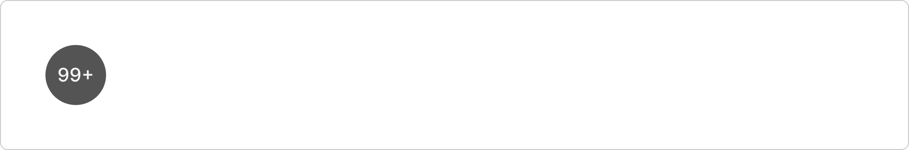
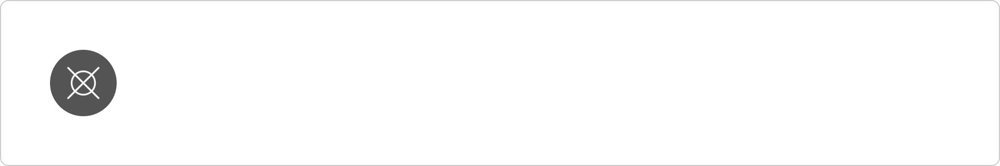
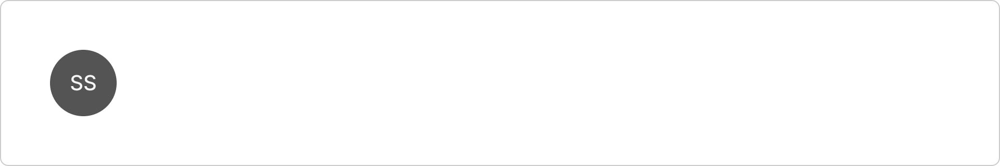
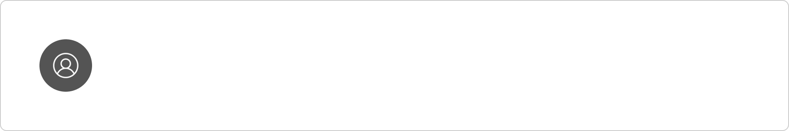
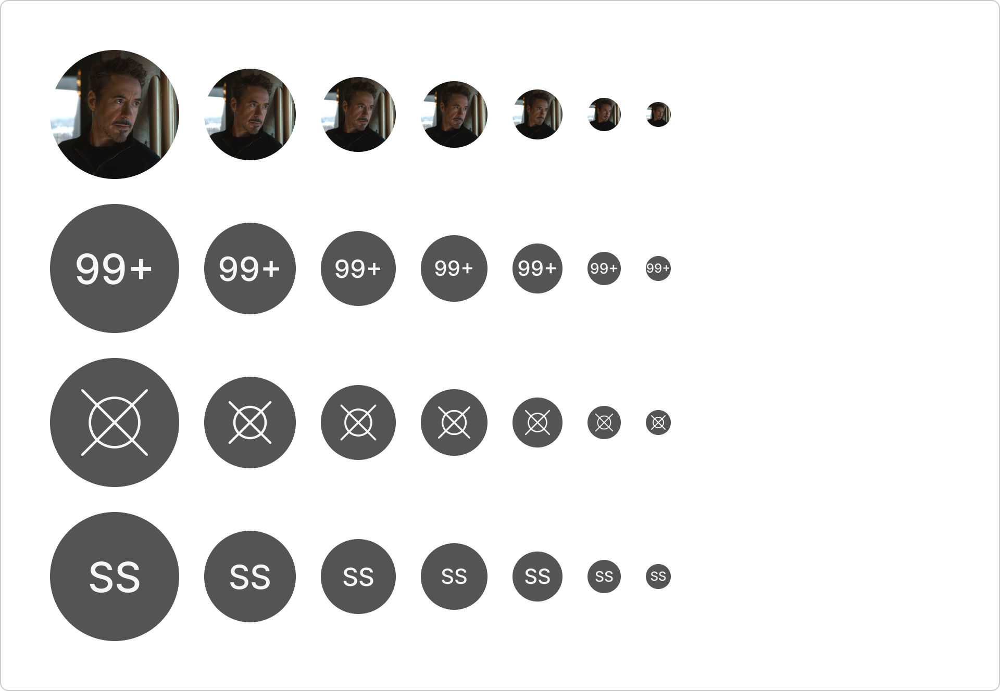
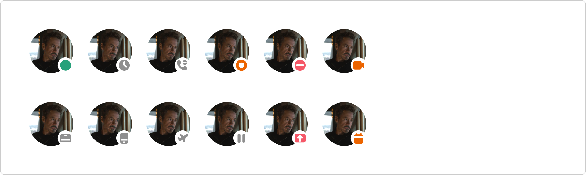
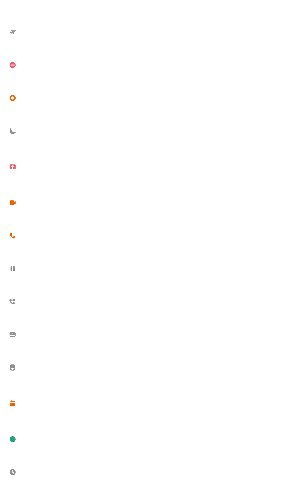
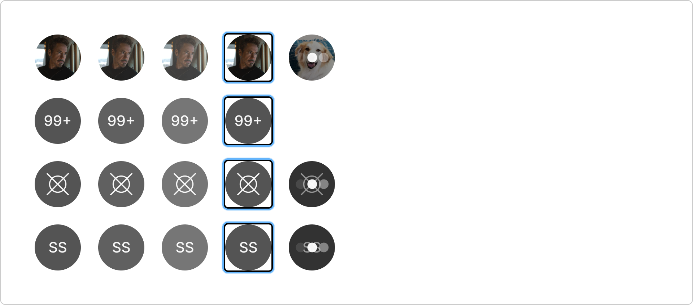
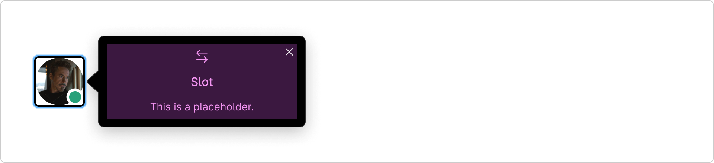

# Avatar (`mdc-avatar`)

## Development

### Summary

The `mdc-avatar` component is used to represent a person or a space.
An avatar can be an icon, initials, counter and photo.

To set the photo of an avatar,
you need to set "src" attribute.

While the avatar image is loading, as a placeholder,
we will show the initials text.
If the initials are not specified then,
we will show `user-regular` icon as a placeholder.

By default, if there are no attributes specified,
then the default avatar will be an icon with `user-regular` name.

The avatar component is non clickable and non interactive/focusable component.
If the avatar is typing, then the loading indicator will be displayed.
If the counter type avatar is set to a negative number, then we will display 0.
The presence indicator will be hidden when the counter property is set.

### Source

- Component folder: [`packages/components/src/components/avatar/`](../../components/src/components/avatar/)
- Built metadata references: `components/avatar/avatar.component.js` (from Custom Elements Manifest)

### Install and global setup

Install the library:

```bash
npm install @momentum-design/components
```

Load fonts and token CSS, set typography class, and use **ThemeProvider** / **IconProvider** where needed. Follow the full checklist in [Consumption.mdx](../../components/src/docs/Consumption.mdx) (imports, HTML example, webpack/TS notes).

### Import this component

**Web component** (registers the custom element):

```javascript
import '@momentum-design/components/components/avatar';
```

```html
<mdc-avatar></mdc-avatar>
```

**React** wrapper (from `@lit/react` codegen):

```javascript
import { Avatar } from '@momentum-design/components/react';
```

```jsx
<Avatar />
```

### Styling and common attributes

- Host `class` / `style`, CSS custom properties, `::part(...)`, and slotted content patterns: [Styling.mdx](../../components/src/docs/Styling.mdx)
- Shared attribute `auto-focus-on-mount`: [Attributes.mdx](../../components/src/docs/Attributes.mdx)

### API details

Full properties, attributes, slots, CSS parts, and events are listed in the Custom Elements Manifest. Use **Storybook** on [momentum.design](https://momentum.design/storybook-static/index.html) (same content as [momentum.design/en/components](https://momentum.design/en/components)) for interactive docs.


## Accessibility

Project Storybook enables the **Accessibility** addon with axe rules for **WCAG 2.x / 2.2 AA** and **best-practice** (see [`preview.jsx`](../../components/config/storybook/preview.jsx), `parameters.a11y`). Run checks from the [Docs](https://momentum.design/storybook-static/index.html?path=/docs/components-avatar--docs) or Canvas view.

- **Focus:** shared attribute `auto-focus-on-mount` is documented in [Attributes.mdx](../../components/src/docs/Attributes.mdx) (use instead of native `autofocus`; same caveats as MDN describes for autofocus).

Use the Storybook **Docs** and **Accessibility** addon on the Example story for roles, keyboard support, labeling, and color-contrast results.

## Design

Design guidance is taken from the [Momentum Component Guidelines — Avatar](https://www.figma.com/design/MrrkzCQ0YXzUTca2XhesDZ/%F0%9F%93%9C-Momentum-Component-Guidelines?node-id=814-17315) frame in Figma.

**Component references (Storybook):** [Avatar](https://momentum.design/storybook-static/index.html?path=/docs/components-avatar--docs), [Avatar button](https://momentum.design/storybook-static/index.html?path=/docs/components-avatarbutton--docs), [Presence](https://momentum.design/storybook-static/index.html?path=/docs/components-presence--docs).

### Overview

An avatar is a small image or icon used to visually represent a user, profile, or identity in online platforms, websites, and applications. Avatars can be photographs, illustrations, icons, or even stylized graphics that reflect the user's personality, preferences, or branding.


*An example of a photo avatar with presence.*

### Types and variants

Avatars come in a variety of styles and formats, allowing users to express themselves in different ways. Common variations of avatars include:

#### Photo

Photo avatars are used in a variety of digital contexts to visually represent users and add a personal touch to online interactions. Photo avatars are commonly used when people want to present a genuine or professional image, fostering recognition and trust in digital spaces.


#### Counter

An avatar with a counter number includes a number displayed instead of a profile photo, icon, or initials. The number represents multiple users.

Note that the counter avatar will not have any presence associated with it nor will it have a 'typing' state.



#### Icon

An icon avatar provides a visual cue, such as a small flag to represent a country, a role (admin, moderator), or a verified account icon, making it easier for others to quickly identify the user's role or status without needing detailed information.



#### Initial

An avatar with initials instead of a photo is a type of profile image that displays a user's initials (usually the first letter of their first and last name) rather than a photograph or graphic. This is commonly used in platforms where a user doesn't upload a personalized picture or where minimalism is preferred. The initials are typically shown in a simple, often circular or square design, sometimes with a colored background, and are automatically generated based on the user's name.



#### Default state

When an avatar does not have a photo, counter, initial or icon to load, it should automatically default to the icon variant with the "user" icon.



### Sizes

Below are the common avatar sizes we use within our products:

- 2X-Large (124px)
- X-Large (88px)
- Large (72px)
- Midsize (64px)
- Small (48px)
- X-Small (32px) - Default size
- 2X-Small (24px)

The default avatar size is X-Small at 32px.



*Examples of different avatar sizes used in our products.*

### Presence

An avatar with presence is a user profile image or icon that also displays the user's real-time status or availability in an online environment. The presence is typically indicated by small colored icons or symbols overlaid on or near the avatar, providing information about the user's current status.



*Examples of different presence indicators for avatars.*

#### Presence types

Below are all the available presence types used in an avatar, ordered by precedence. Colors are limited to what is defined below for each presence type: indicator/attention, indicator/locked, indicator/stable, indicator/unstable.

Please note that presence icons used within Avatars have a minimum size of 14px to meet accessibility standards.



| Status | Color | Description |
| --- | --- | --- |
| Out of office / PTO | `indicator/locked` | Manually set by the user (via Outlook) to indicate they are on vacation. |
| Do not disturb | `indicator/attention` | Manually set by the user to indicate not wanting to be disturbed. |
| Busy | `indicator/unstable` | Manually set by user to indicate they are busy. |
| Quiet | `indicator/locked` | Manually set by user to indicate they are away from their desk. |
| Presenting | `indicator/attention` | Automatically set by the system indicating that a user is currently presenting or sharing their screen. |
| Meeting | `indicator/unstable` | Automatically set by the system to indicate a user is in a meeting. |
| On call | `indicator/unstable` | Automatically set by the system to indicate a user is on a phone call. |
| On hold | `indicator/locked` | Automatically set by the system when a user is on call but placed on hold. |
| Away - Calling | `indicator/locked` | Manually set by a Calling service user to indicate they are away. |
| On device | `indicator/locked` | Automatically set by the system to indicate a user is on a device. |
| On mobile | `indicator/locked` | Automatically set by the system to indicate a user is on a mobile device. |
| Scheduled | `indicator/unstable` | Automatically set by the system indicating that the user has a currently scheduled meeting. |
| Active | `indicator/stable` | Automatically set by the system when a user is online and available. |
| Away | `indicator/locked` | Automatically set by the system when a user is idle. |

### Behavior

An avatar can be static or dynamic depending on the platform, design, or context. Here are some common behaviors avatars may exhibit:

- **Static** — The avatar is simply an image or icon representing the user or entity. It remains unchanged until manually updated.
- **Interactive** — Users can interact with avatars by clicking or tapping, often leading to additional actions.
- **Presence** — Displays the user's real-time status or availability in an online environment.
- **Counter (multiple users)** — Displays the total amount of users within a space or context of the container.

### States

Avatar states include rest, hover, pressed, active, focused, and typing. Note: Initial variant does not include typing states.



### Clickable interactions

An avatar is clickable when a popover is available, such as an Avatar with profile popover in the Webex App. See also [Avatar Storybook documentation](https://momentum.design/storybook-static/index.html?path=/docs/components-avatar--docs) for accessibility, including keyboard interaction and screen reader announcements.

The clickable state to open popovers is available for all variations of the avatar and is accessible via the [popover](./popover.md) component.



*An example of a clickable Avatar with popover.*
