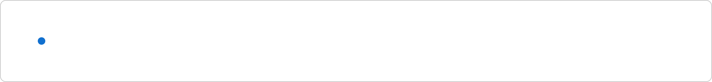
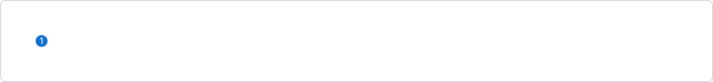
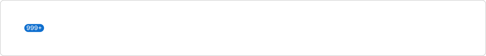
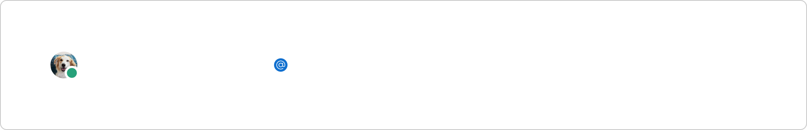
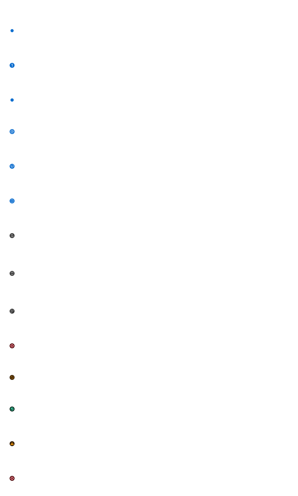
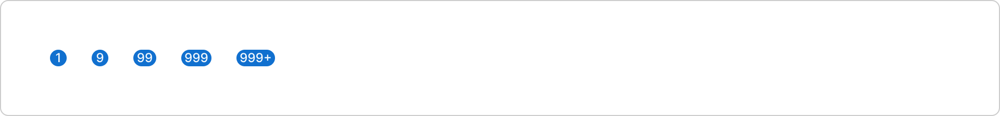

# Badge (`mdc-badge`)

## Development

### Summary

The `mdc-badge` component is a versatile UI element used to
display dot, icons, counters, success, warning and error type badge.

Supported badge types:
- `dot`: Displays a dot notification badge with a blue color.
- `icon`: Displays a badge with a specified icon using the `icon-name` attribute.
- `counter`: Displays a badge with a counter value. If the counter exceeds the `max-counter`,
it shows `maxCounter+`. The maximum value of the counter is 999 and anything above that will be set to `999+`.
- `success`: Displays a success badge with a check circle icon and green color.
- `warning`: Displays a warning badge with a warning icon and yellow color.
- `error`: Displays a error badge with a error legacy icon and red color.

For `icon`, `success`, `warning` and `error` types, the `mdc-icon` component is used to render the icon.

For the `counter` type, the `mdc-text` component is used to render the counter value.

### Source

- Component folder: [`packages/components/src/components/badge/`](../../components/src/components/badge/)
- Built metadata references: `components/badge/badge.component.js` (from Custom Elements Manifest)

### Install and global setup

Install the library:

```bash
npm install @momentum-design/components
```

Load fonts and token CSS, set typography class, and use **ThemeProvider** / **IconProvider** where needed. Follow the full checklist in [Consumption.mdx](../../components/src/docs/Consumption.mdx) (imports, HTML example, webpack/TS notes).

### Import this component

**Web component** (registers the custom element):

```javascript
import '@momentum-design/components/components/badge';
```

```html
<mdc-badge></mdc-badge>
```

**React** wrapper (from `@lit/react` codegen):

```javascript
import { Badge } from '@momentum-design/components/react';
```

```jsx
<Badge />
```

### Styling and common attributes

- Host `class` / `style`, CSS custom properties, `::part(...)`, and slotted content patterns: [Styling.mdx](../../components/src/docs/Styling.mdx)
- Shared attribute `auto-focus-on-mount`: [Attributes.mdx](../../components/src/docs/Attributes.mdx)

### API details

Full properties, attributes, slots, CSS parts, and events are listed in the Custom Elements Manifest. Use **Storybook** on [momentum.design](https://momentum.design/storybook-static/index.html) (same content as [momentum.design/en/components](https://momentum.design/en/components)) for interactive docs.


## Accessibility

Project Storybook enables the **Accessibility** addon with axe rules for **WCAG 2.x / 2.2 AA** and **best-practice** (see [`preview.jsx`](../../components/config/storybook/preview.jsx), `parameters.a11y`). Run checks from the [Docs](https://momentum.design/storybook-static/index.html?path=/docs/components-badge--docs) or Canvas view.

- **Focus:** shared attribute `auto-focus-on-mount` is documented in [Attributes.mdx](../../components/src/docs/Attributes.mdx) (use instead of native `autofocus`; same caveats as MDN describes for autofocus).

Manifest / API fields that often relate to accessibility:

- `aria-label` — Aria-label attribute to be set for accessibility

## Design

Design guidance is taken from the [Momentum Component Guidelines — Badge](https://www.figma.com/design/MrrkzCQ0YXzUTca2XhesDZ/%F0%9F%93%9C-Momentum-Component-Guidelines?node-id=814-19379) frame in Figma.

**Reference:** [Badge — Storybook](https://momentum.design/storybook-static/index.html?path=/docs/components-badge--docs).

### Overview

A badge is a small, visually distinct element that provides additional information or highlights the status of an item. Badges are often used to display notifications, counts, or labels in a compact form, making them a useful tool for conveying information quickly without taking up much space.


*An example of a dot badge.*

### Types and variants

Badges are versatile elements used to convey various types of information. They can serve multiple purposes, depending on the context. Here are the different types of badges commonly used in UI design:

#### Dot

A dot badge indicates the presence of new or unread notifications, messages, or alerts.



*An example of a notification badge.*

#### Counter

Counter badges display a numerical value, usually indicating the count of specific new items, notifications, messages, or other quantifiable elements. They are often used to notify users about updates, alerts, unread messages or tasks that require their attention, providing a clear and concise way to communicate information at a glance.

If there is more than the counter can show, use the label badge and add a + at the end of the count. Always use a + after your counter numbers. The + indicator counts toward total character count.



*An example of a counter badge.*



*An example of a counter badge in a label style.*

#### Icon

Icon badges are used for situations such as “at-mention” badges as well as alert badges. These icons are limited for use inside of lists, e.g. Webex app messaging panel



*An example of an “Mention to me” icon badge in a list item.*

### Colors and usage types

Each badge type will have a set of specific colors associated with it. See below for the correct color usage along with the usage type for each.



| Usage type | Color | Description |
| --- | --- | --- |
| Surface / Button / Tab | `background/accent/normal` | **Dot** — Used to denote new or unread activity. |
| Surface / Button / Tab | `background/accent/normal`, `common/text/primary/normal` | **Counter** — Used to indicate the specific count of new activity, such as unread notifications. |
| List item | `background/accent/normal` | **Icon, New message** — Used to denote a new message. |
| List item | `background/accent/normal`, `common/text/primary/normal` | **Icon, Mention to me** — Used to denote mentions to a specific user in a message space. |
| List item | `background/accent/normal`, `background/accent/normal` | **Icon, All mention** — Used to denote mentions to all users in a message space. |
| List item | `background/accent/normal`, `background/accent/normal` | **Icon, New space** — Used to denote a new space has been created in the Webex app. |
| List item | `background/alert/default/normal`, `theme/text/secondary/normal` | **Icon, Mute** — Used to denote a space has been muted in the Webex app. |
| List item | `background/alert/default/normal`, `theme/text/secondary/normal` | **Icon, Notify when active** — Used to denote a space has notifications and alerts in the Webex app. |
| List item | `background/alert/default/normal`, `theme/text/secondary/normal` | **Icon, Draft** — Used to denote a message is being drafted. |
| List item | `background/alert/error/normal`, `theme/text/error/normal` | **Icon, Failed to send** — Used to denote a message has failed to send. |
| List item | `background/alert/warning/normal`, `theme/text/warning/normal` | **Icon, Hiding presence** — Used to a user's hidden presence. |
| Surface / Button / Tab / List item | `background/alert/success/normal`, `theme/text/success/normal` | **Success** |
| Surface / Button / Tab / List item | `background/alert/warning/normal`, `theme/text/warning/normal` | **Warning** |
| Surface / Button / Tab / List item | `background/alert/error/normal`, `theme/text/error/normal` | **Error** |

### Colors for status indicators

Badge indicators are also used in conjunction with statuses with the following colors:


| Status | Color | Description |
| --- | --- | --- |
| Secure | `theme/indicator/secure` | Used to denote a feature or item is secure within the system. |
| Locked | `theme/indicator/locked` | Used to denote a feature or item is locked an inaccessible. |
| Stable | `theme/indicator/stable` | Used to denote a feature or item is stable and online. |
| Unstable | `theme/indicator/unstable` | Used to denote a feature or item is unstable. |
| Attention | `theme/indicator/attention` | Used to denote a feature or item has an error and needs immediate attention. |
| Caution | `theme/indicator/caution` | Used to denote a feature or item with a warning. |

### Sizes

Badges have a maximum boundary height and width of 16px. For counter badges, the height is fixed at 16px and the minimum width is 16px, but the width can grow depending on the number shown.

#### Counter

The counter can show at most three numerical digits. When the number exceeds three digits, append a plus (+) to the end of the third digit. For example, we can show up to “999”, but beyond that, the counter shows “999+”.



*An example of a counter badge with a maximum of three numerical digits and a +.*

### Usage

Badges can be used as modifiers for buttons, tabs, or list items. However, make sure that you’re using them to communicate temporary information. For permanent information, leverage tags.

It is typically used in menu items to designate a part of the application that contains new or unread information. It can also be used in list items and on iconography.

Badges are temporary and will be cleared by the user, typically after selection.

#### When to use

Badges can be used to communicate status, particularly newness or unread status.

- **Notifications:** Use badges to draw attention to new or unread notifications, such as messages or alerts
- **Statuses:** Use badges to indicate the status of an item or task, such as "In progress" or "Complete".
- **Counters:** Use badges to display the number of items in a particular category or section, such as items in a shopping cart or results in a search.

#### When not to use

Badges, particularly the label badge can be confused with the chip. Try to remember that badges communicate status, chips can be used to communicate category or type.

- **Overuse:** Don't use badges excessively, as this can overwhelm the user and make the interface look cluttered.
- **Unimportant information:** Don't use badges to draw attention to information that is not particularly important or relevant to the user.

### Coming soon

Below is a list of updated content coming soon.

- Do’s and Don’ts
- Related components
